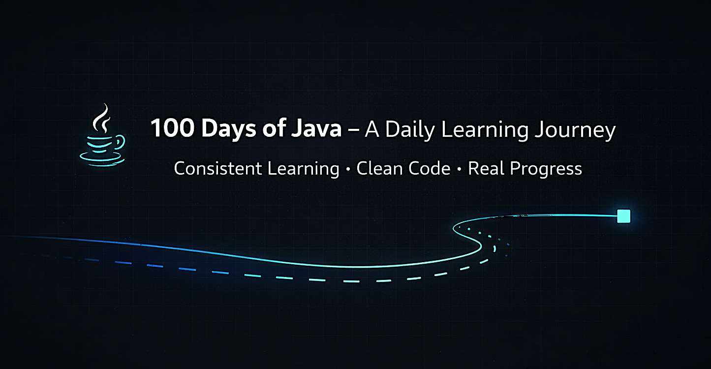

<div align="center">

  <br />
    
  <br />

  <div>
    
    
    
    
  </div>

  <h3 align="center">100 Days of Java – A Daily Learning Journey</h3>

  <p align="center">
    Building strong Java fundamentals through daily coding, consistency, and structured learning.
  </p>

</div>

---

## 📋 Table of Contents

1. 📘 [Introduction](#introduction)
2. 🎯 [Goals & Outcomes](#goals--outcomes)
3. 📜 [Rules I Follow](#rules-i-follow)
4. 📅 [Daily Progress Tracker](#daily-progress-tracker)
5. 🗂️ [Repository Structure](#repository-structure)
6. ⭐ [What Makes This Different](#what-makes-this-different)
7. 🛠️ [How to Use This Repository](#how-to-use-this-repository)
8. 📦 [How to Run the Programs](#how-to-run-the-programs)
9. 📈 [GitHub Stats](#github-stats)
10. 🔗 [Connect With Me](#connect-with-me)
11. 🚀 [Closing Note](#closing-note)

---

## 📘 Introduction

Welcome to my **100 Days of Java Journey**, where I consistently learn, code, and document Java fundamentals one day at a time.

This repository is built with a focus on **discipline, clarity, and real understanding**, not just random code uploads.

It represents a structured approach to becoming better in:

- Core Java
- Problem-solving
- Writing clean and readable code
- Building strong programming habits

---

## 🎯 Goals & Outcomes

- Build strong Core Java fundamentals
- Practice daily real programs
- Document learning clearly
- Write recruiter-friendly code and explanations
- Bridge the gap between theory and practical implementation

---

## 📜 Rules I Follow

1. Write Java code **every single day**
2. Create a dedicated folder for each day
3. Include:
   - Java source code
   - Clear explanation in `README.md`
4. Use meaningful commit messages
5. Never skip documentation
6. Maintain consistency publicly on GitHub

---

## 📅 Daily Progress Tracker

- 🔹 [Day 001 – Java Introduction & Hello World](./Day-001)
- 🔹 [Day 002 – Variables & Data Types](./Day-002)
- 🔹 [Day 003 – Input using Scanner](./Day-003)
- 🔹 [Day 004 – Operators in Java](./Day-004)
- 🔹 [Day 005 – If-Else Decision Making](./Day-005)
- 🔹 [Day 006 – Else-If Ladder & Switch Statement](./Day-006)

> More days will be added continuously as the journey progresses.

---

## 🗂️ Repository Structure

```text
100-days-of-java/
├── Day-001/
│   ├── HelloWorld.java
│   └── README.md
│
├── Day-002/
│   ├── VariablesDemo.java
│   └── README.md
│
├── Day-003/
│   ├── ScannerInput.java
│   └── README.md
│
├── Day-005/
│   ├── IfElseProgram.java
│   └── README.md
│
└── README.md
```

Each folder represents one day = one concept + one implementation.

## ⭐ What Makes This Different

- Daily structured learning approach
- Clear explanations along with code
- Focus on fundamentals over shortcuts
- Clean and readable code practices
- Consistent and disciplined progress tracking

## 🛠️ How to Use This Repository

- Start from Day 001
- Read the README for concept clarity
- Open and understand the Java code
- Run the program locally
- Try modifying and experimenting

## 📦 How to Run the Programs

Compile and run using:

javac FileName.java
java FileName

Replace FileName with the actual Java file name.

## 📈 GitHub Stats

<p align="center">  </p> <p align="center">  </p> <p align="center">  </p>
🔗 Connect With Me
<p align="center"> <a href="https://github.com/Krushna4142" target="_blank">  </a> <a href="https://www.linkedin.com/in/krushna4142" target="_blank">  </a> <a href="mailto:krushnanawale4142@gmail.com">  </a> </p>

## 🚀 Closing Note

This repository is more than just code — it reflects a daily commitment to growth.

Learning with discipline and documenting clearly is the key to mastering any skill.

One day at a time. One concept at a time. One step closer to becoming a better developer.
