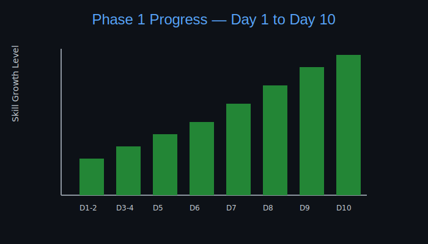

# 📈 Phase 1 Visual Progress Report

---

## 📊 What This Graph Represents

Each bar represents:

- Confidence growth
- Concept clarity
- Debugging ability
- Code structure improvement

Growth increased significantly after:

- Loops (Day 7–8)
- Arrays (Day 9–10)

---

## 🧠 Key Insight

Early days → Syntax understanding  
Middle days → Logic building  
Final days → Confidence + structure

Phase 1 was about building **strong foundations**.

---

## 🎯 Completion Status

Days Completed: 10 / 10  
Consistency: 100%  
Foundation Strength: Solid

Ready for Phase 2 🚀
